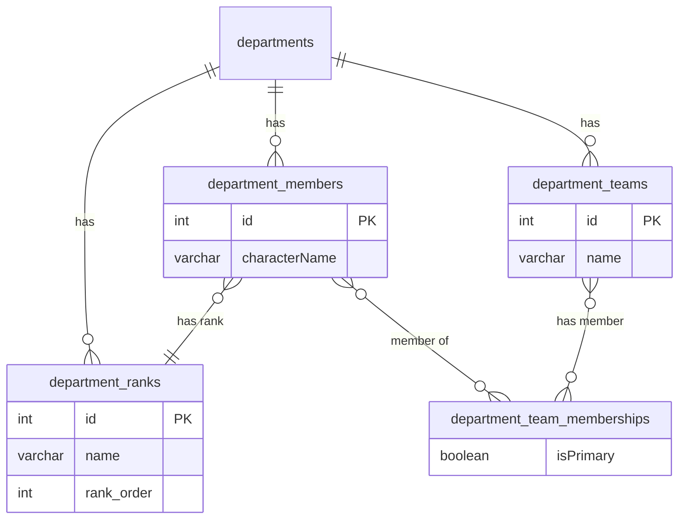

# FiveM Department Management System

## Overview

This project is a comprehensive Department Management System designed for FiveM roleplaying communities. It provides a robust backend for managing departments like Law Enforcement, Fire/EMS, and Staff teams.

The system is built using the T3 Stack (Next.js, tRPC, Tailwind CSS) and Drizzle ORM. It features a **hybrid database architecture**, utilizing **PostgreSQL** for department management data and **MySQL** for user authentication and core application data. This design ensures both data integrity for relational department information and compatibility with modern authentication solutions.

This system facilitates detailed management of members, ranks, teams, callsigns, activity tracking, and much more, providing a solid foundation for a community's organizational structure.

---

## Architecture

The application is structured following the principles of the T3 Stack, with a clear separation of concerns between the frontend, backend, and data layers. It uses a hybrid database model to leverage the strengths of both PostgreSQL and MySQL.

```mermaid
graph TD
    subgraph "Browser"
        A[Next.js Frontend]
    end

    subgraph "Server"
        B[tRPC API Routes]
    end

    subgraph "Databases"
        C[PostgreSQL Database<br>(Department Data)]
        D[MySQL Database<br>(User & Auth Data)]
    end

    subgraph "External Services"
        E[Discord API]
    end

    A -- "tRPC Calls" --> B

    B -- "User/Auth Data" --> D
    B -- "Department Data" --> C
    B -- "Role Sync" --> E

    E -- "Webhooks" --> B
```

---

## Project Structure

The codebase is organized into the following main directories:

-   `src/app/`: The Next.js App Router, containing all pages and layouts.
-   `src/components/`: Shared, reusable React components.
-   `src/server/`: The backend, containing the tRPC API and database logic.
    -   `src/server/api/`: tRPC routers, procedures, and services.
    -   `src/server/db/`: The MySQL schema and Drizzle client for authentication.
    -   `src/server/postgres/`: The PostgreSQL schema and Drizzle client for department data.
-   `src/lib/`: Utility functions and helper scripts.
-   `drizzle/`: Contains database migration files generated by Drizzle Kit.

---

## Getting Started

### Prerequisites

-   [Node.js](https://nodejs.org/en/) (v20.x or higher)
-   [pnpm](https://pnpm.io/installation)
-   [Docker](https://docs.docker.com/get-docker/) or [Podman](https://podman.io/getting-started/installation)

### 1. Initial Setup

First, clone the repository and install the dependencies:

```bash
git clone https://github.com/your-username/jgn-client.git
cd jgn-client
pnpm install
```

### 2. Environment Variables

Create a `.env` file in the root of the project by copying the example file:

```bash
cp .env.example .env
```

You will need to fill out the variables in this file. The two most important variables for local development are `DATABASE_URL` (for MySQL) and `PG_URL` (for PostgreSQL).

The `start-database.sh` script relies on the PostgreSQL URL to configure the local database container.

### 3. Start the Databases

This project requires two databases. The provided script will start a local **PostgreSQL** database using Docker:

```bash
./start-database.sh
```

**Note:** You will need to set up a separate **MySQL** database and add its connection string to the `DATABASE_URL` variable in your `.env` file. You can use a local MySQL server or a service like PlanetScale, Aiven, etc.

### 4. Run Database Migrations

Once the databases are running and the `.env` file is configured, apply the schemas to them using Drizzle Kit.

First, push the schema for the **PostgreSQL** database:

```bash
pnpm db:pg:push
```

Next, push the schema for the **MySQL** database:

```bash
pnpm db:push
```

### 5. Start the Development Server

Now you can start the Next.js development server:

```bash
pnpm dev
```

The application should now be running at [http://localhost:3000](http://localhost:3000).

---

## Database

The backend uses Drizzle ORM with a hybrid PostgreSQL and MySQL database setup.

-   **PostgreSQL**: Manages all data related to the department management system, including departments, ranks, members, and teams. The schema is highly relational and designed to ensure data integrity for these core features.
-   **MySQL**: Handles user authentication, sessions, and other core application data, leveraging a schema compatible with the `better-auth` library.

### Department Schema (PostgreSQL)

The following diagram shows the core relationships in the PostgreSQL database:



### Core Tables (PostgreSQL):
-   `dept_departments`: Stores the main department configurations.
-   `dept_ranks`: Defines all available ranks, their hierarchy, and permissions.
-   `dept_teams`: Defines specialized teams within each department.
-   `dept_members`: The central table for all department members, linking to their rank, team, and other information.

### Feature Tables (PostgreSQL):
-   `dept_id_numbers`: Manages the pool of recyclable ID numbers for the callsign system.
-   `dept_time_clock_entries`: Records all clock-in/out and break events for members.
-   `dept_meetings`: Stores information about scheduled meetings.
-   `dept_meeting_attendance`: Tracks member attendance for each meeting.
-   `dept_promotion_history`: Logs all rank changes for members.
-   `dept_disciplinary_actions`: A record of all disciplinary actions taken against members.
-   `dept_certifications`: Defines available certifications (e.g., "Field Training Officer").
-   `dept_member_certifications`: Junction table linking members to the certifications they have earned.
-   `dept_team_rank_limits`: Stores the override rules for rank limits within specific teams.

---

## Key Features

-   **Multi-Department Support**: Easily manage separate Law Enforcement, Fire Department, and Staff teams, each with its own configuration.
-   **Hierarchical Ranks**: Define a clear rank structure with specific, granular permissions for each rank.
-   **Team System**: Organize members into specialized teams within departments (e.g., SWAT, Detective Division, Paramedics).
-   **Advanced Member Management**: Track member status (active, inactive, leave of absence), hire dates, and roleplay character information.
-   **Dynamic Callsign Generation**: Automatically generates unique, structured callsigns for members based on their rank, department, and team assignment.
-   **Rank & Team Capacity Limits**: Enforce realistic limits on the number of members that can hold a specific rank, either department-wide or for specific teams.
-   **Time Clock System**: Allows members to clock in, clock out, and go on break, tracking their total activity time for payroll or activity checks.
-   **Meeting & Attendance Module**: Schedule department or team-specific meetings and track member attendance (present, absent, excused, late).
-   **Personnel Records**: Maintain detailed historical records for each member, including promotions/demotions, disciplinary actions, and awarded certifications.
-   **Granular Permissions System**: A comprehensive boolean-based permission system controls access to virtually every action.
-   **Discord Integration**: Automatically synchronize department ranks with Discord roles.

---

## In-Depth Feature Explanations

### Discord Integration

The system features deep integration with Discord to synchronize roles with in-game ranks automatically.

-   **Source of Truth**: The integration uses a "Discord-first" approach. When a member is promoted or demoted via the application, the system first attempts to update the user's roles on Discord. If the Discord update is successful, a webhook is triggered that updates the application's database. This ensures the application and the Discord server are always in sync.
-   **Synchronization**: A dedicated webhook endpoint listens for role changes on your Discord server. When a user's roles are changed for any reason, the webhook triggers a process to update their rank in all relevant departments within the application, based on the highest role they possess.
-   **Configuration**: To enable this, you must link departments to a `discordGuildId` and ranks to a `discordRoleId` in the database. You will also need to configure API keys (`DEPARTMENT_TRAINING_API_KEY`, `M2M_API_KEY`) in your `.env` file to secure the webhook and internal API calls.

### Granular Permissions System

Access control is managed by a set of boolean flags associated with each rank. This allows for highly specific and customizable permission sets. Key permissions include:

-   `manage_department`: Full control over department settings.
-   `manage_ranks`: Create, edit, and delete ranks.
-   `manage_teams`: Create, edit, and delete teams.
-   `manage_members`: Full control over the member roster.
-   `recruit_members`: Add new members to the department.
-   `promote_members`: Promote members to a higher rank.
-   `demote_members`: Demote members to a lower rank.
-   `discipline_members`: Issue disciplinary actions.
-   `manage_timeclock`: Edit and manage time clock entries for others.
-   `schedule_meetings`: Create and manage department meetings.

### Callsign Generation System

The callsign system is designed to provide clear and consistent identifiers for all members while on duty.

-   **Format**: `[RANK_CALLSIGN][DEPARTMENT_PREFIX]-[ID_NUMBER]([TEAM_PREFIX])`
-   **Example**: `1LSPD-425(UNI)` represents a member with Rank 1 in the Los Santos Police Department, with ID #425, assigned to the Uniform Patrol team.
-   **Components**:
    -   `RANK_CALLSIGN`: A numerical identifier for the rank's position in the hierarchy.
    -   `DEPARTMENT_PREFIX`: A short identifier for the department (e.g., "LSPD", "SAFD").
    -   `ID_NUMBER`: A unique 3-digit number (100-999) assigned to a member for the duration of their service in a department. These IDs are recycled when a member leaves.
    -   `TEAM_PREFIX`: An optional short identifier for the member's primary team (e.g., "SW", "DET").

### Rank Limit System

This feature enables realistic organizational structures by limiting the number of members who can hold a specific rank.

-   **Department-Level Limits**: A global limit can be set for a rank across the entire department. For example, a department might be limited to only one "Chief of Police". A `NULL` value means the rank has unlimited slots.
-   **Team-Level Overrides**: A department-level limit can be overridden for a specific team. For instance, the department might allow 5 "Captains" in total, but the SWAT team's internal structure might be limited to only one "SWAT Captain". Team-level limits must be a positive integer and cannot be unlimited.

---

## Tech Stack

This project is built with the [T3 Stack](https://create.t3.gg/).

-   [Next.js](https://nextjs.org)
-   [tRPC](https://trpc.io)
-   [Tailwind CSS](https://tailwindcss.com)
-   [Drizzle ORM](https://orm.drizzle.team)
-   [NextAuth.js](https://next-auth.js.org) (via `better-auth`)
-   **PostgreSQL** (for department data)
-   **MySQL** (for user data)


